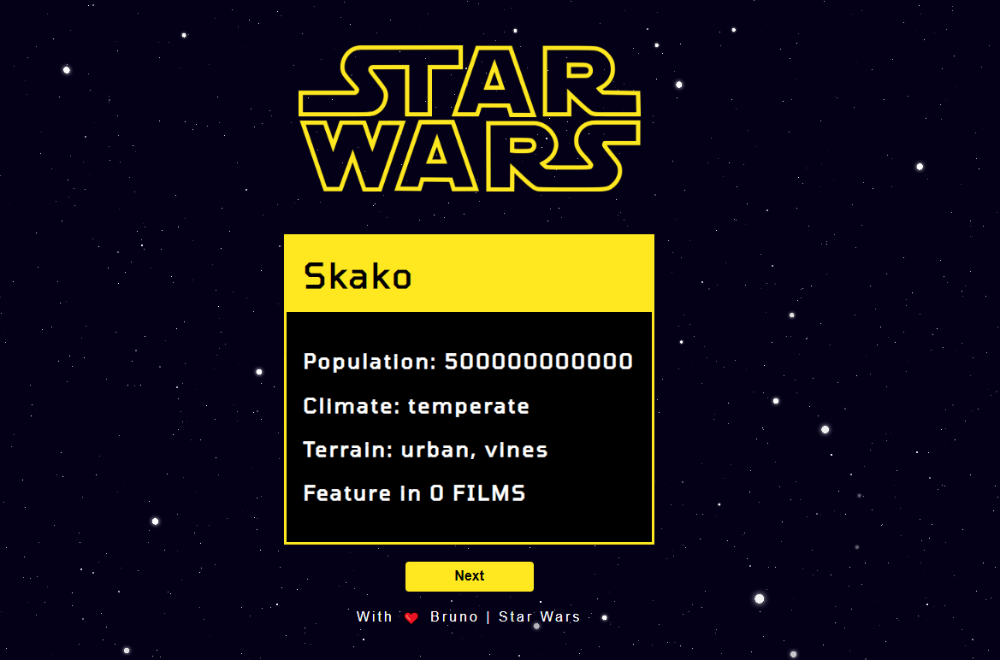

  

<h1 align="center">Random Star wars planets project</h1>

The project consumes <strong>SWAPI</strong> and shows a random planet with some data

## :rocket: Technologies, tools and dependencies

### This project was developed with the following technologies:

| [ReactJS](https://reactjs.org/)
| [CSS](https://www.w3schools.com/css/)
| [Axios](https://github.com/axios/axios)
|

## :memo: Project

#### ReacjJS application that consumes the Starwars API showing the data of the planets at random

## :computer: Screen

</img>

## :round_pushpin: Installing the Project

1 - <strong>git clone https://github.com/vespidhook/api-reactjs.git</strong> | to download the repository  
2 - <strong>npm install </strong> | to install the dependencies 
3 - <strong>npm start</strong> | to start the project at port 3000 

## :memo: License

#### This project is under license [MIT](./LICENSE) &copy; [SWAPI](https://swapi.co/)
